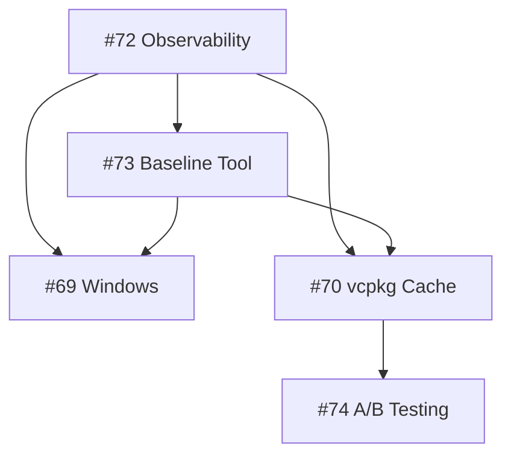

# v0.3 Project Board Priority Update

**Updated**: 2025-09-22 02:30 UTC+8
**Sprint**: Week 1 (2025-09-22 to 2025-09-28)
**Focus**: Observability & Measurement Foundation

## 📋 Current Priority Order

### 🔴 P0 - Critical (This Week)
#### #72 - CI Observability Enhancement ⭐⭐⭐
- **Status**: 60% Complete
- **Done**: p50/p95 metrics, markdown tables
- **Next**: 7-day trends, cache metrics
- **Owner**: Active development
- **Why P0**: Foundation for all other measurements

### 🟠 P1 - High (This Week)
#### #73 - Baseline Comparison Report Generator ⭐⭐
- **Status**: 20% Complete
- **Done**: Markdown report capability
- **Next**: Automated comparisons in CI
- **Owner**: Starting after #72 trends
- **Why P1**: Needed to track v0.3 progress

### 🟡 P2 - Medium (Week 1-2)
#### #69 - Windows CI Build Acceleration ⭐
- **Status**: 10% Complete
- **Done**: Issue created, monitoring active
- **Next**: Collect failure patterns, identify bottlenecks
- **Owner**: Data collection phase
- **Why P2**: Major pain point but needs metrics first

#### #70 - vcpkg Cache Optimization ⭐
- **Status**: 0% Complete
- **Done**: Planning only
- **Next**: Baseline measurements needed
- **Owner**: Blocked by #72, #73
- **Why P2**: 30% performance target but needs foundation

### 🟢 P3 - Low (Week 3+)
#### #74 - Cache Strategy A/B Testing
- **Status**: 0% Complete
- **Done**: Framework design
- **Next**: Wait for #70 initial implementation
- **Owner**: Future sprint
- **Why P3**: Advanced optimization, not critical path

## 🎯 Sprint 1 Deliverables

### By EOD Monday (09/23)
- [ ] #72: Complete 7-day trend calculation
- [ ] #72: Add cache hit rate extraction
- [ ] #73: Start automated comparison workflow

### By EOD Wednesday (09/25)
- [ ] #72: Full observability suite operational
- [ ] #73: First automated comparison report
- [ ] #69: Windows failure pattern analysis

### By EOD Friday (09/27)
- [ ] Sprint 1 review & metrics report
- [ ] Baseline comparison showing trends
- [ ] Sprint 2 planning with data-driven priorities

## 📊 Success Metrics

| Metric | Current | Target | Progress |
|--------|---------|--------|----------|
| Observability Coverage | 60% | 100% | 🟡 On Track |
| Baseline Comparisons | Manual | Automated | 🟠 In Progress |
| Windows Success Rate | ~90% | >95% | 🟡 Monitoring |
| vcpkg Build Time | 4 min | <2.8 min | ⚪ Not Started |
| Cache Hit Rate | Unknown | >80% | ⚪ Measuring |

## 🔄 Dependencies

## 📝 Board Organization

### Column Distribution
- **Backlog**: #74 (A/B Testing)
- **Todo**: #70 (vcpkg Cache)
- **In Progress**: #72 (Observability), #73 (Baseline)
- **Monitoring**: #69 (Windows)
- **Done**: (empty - sprint just started)

### Movement Triggers
- Move to "In Progress": When actively coding
- Move to "Blocked": When waiting for dependencies
- Move to "Done": When PR merged or task complete
- Move to "Monitoring": When collecting data only

## 🚀 Action Items

### Immediate
1. Complete #72 trend features (TODAY)
2. Start #73 automation script
3. Analyze Windows CI run data

### This Week
1. Deliver full observability suite
2. Create first automated comparison
3. Document Windows failure patterns

### Next Week
1. Start vcpkg optimization (#70)
2. Review Sprint 1 metrics
3. Plan Sprint 2 priorities

## 📈 Risk & Mitigation

| Risk | Impact | Mitigation |
|------|--------|------------|
| ci_trend_summary.sh missing | High | Create immediately or stub |
| Windows issues complex | Medium | Focus on data first, fix later |
| vcpkg cache complexity | Medium | Start simple, iterate |

## ✅ Decision Log

1. **#72 First**: Need metrics before optimization
2. **#74 Last**: A/B testing requires stable baseline
3. **#69/#70 Parallel**: Can progress simultaneously once metrics ready
4. **Weekly Reviews**: Adjust priorities based on data

---

**Next Review**: 2025-09-25 (Mid-sprint check)
**Sprint End**: 2025-09-28 (Sprint 1 retrospective)