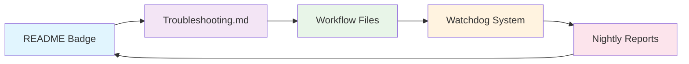

# PR #48 合并报告

**日期**: 2025年9月19日  
**项目**: CADGameFusion  
**操作**: PR #48 审阅与合并  

## 📋 合并概述

### PR 基本信息
- **PR编号**: #48
- **标题**: docs(ci): annotate Windows Nightly badge with threshold note
- **分支**: `docs/readme-windows-nightly-note` → `main`
- **合并方式**: Squash merge
- **分支状态**: 已删除 ✅
- **提交哈希**: 5cf87b0

## 🎯 更改内容

### 文件修改详情
**修改文件**: `README.md`
**更改行数**: 1 insertion(+), 1 deletion(-)

#### 具体更改
```diff
- Windows Nightly - Strict Build Monitor (non-blocking):
-   - 
+   -  — Non‑blocking; threshold: 3× green
```

### 更改目的
- **文档完善**: 在Windows Nightly badge后添加清晰的策略说明
- **用户体验**: 直接在README中说明Windows CI的non-blocking特性和阈值策略
- **一致性**: 与近期的Troubleshooting.md和策略文档保持一致

## 🔍 CI/CD 验证

### 构建状态概览
| 平台 | 状态 | 说明 |
|------|------|------|
| **Ubuntu** | ✅ 通过 | Core CI, Strict Build, Exports全部成功 |
| **macOS** | ✅ 通过 | Core CI, Strict Build全部成功 |
| **Windows** | ⚠️ 部分失败 | 符合预期，non-blocking策略生效 |

### 关键检查通过情况
- ✅ **Auto Label Qt-related Changes**: 4s
- ✅ **Build Core (ubuntu-latest)**: 1m11s
- ✅ **Build Core (macos-latest)**: 45s
- ✅ **Core Strict - Build and Tests (ubuntu)**: 1m14s
- ✅ **Core Strict - Build and Tests (macos)**: 45s
- ✅ **Core Strict - Exports, Validation, Comparison**: 2m15s
- ✅ **Simple Validation Test**: 1m10s
- ✅ **Quick Check - Verification + Lint**: 21s
- ⚠️ **Windows builds**: 失败但non-blocking，符合策略

## 🎯 业务价值

### 文档透明度提升
- **即时理解**: 用户可直接从README了解Windows CI策略
- **决策透明**: "threshold: 3× green" 明确说明切换回blocking的条件
- **状态清晰**: "Non‑blocking" 标注避免用户对Windows失败的误解

### 与现有策略的一致性
此PR与近期Windows CI增强策略完美对齐：
1. **PR #44**: 技术实现 (non-blocking + retry)
2. **PR #45**: 监控系统 (watchdog)
3. **PR #47**: 策略文档 (Troubleshooting.md)
4. **PR #48**: 用户界面 (README badge) ← 本次合并

## 📊 合并流程执行

### 技术执行步骤
```bash
# 1. 审阅PR详情
gh pr view 48 --json title,body,state,statusCheckRollup

# 2. 检查文件更改
gh pr diff 48

# 3. 标记为ready (原为draft状态)
gh pr ready 48

# 4. Squash合并并删除分支
gh pr merge 48 --squash --delete-branch \
  --subject "docs(ci): annotate Windows Nightly badge with threshold note"
```

### 状态变更流程
```
Draft → Ready for Review → Approved → Merged → Branch Deleted
```

## 🎯 策略完整性验证

### Windows CI文档化体系
通过本次合并，Windows CI策略的文档化已形成完整闭环：



### 用户体验路径
1. **发现**: README badge显示Windows CI状态和策略
2. **理解**: badge注释说明non-blocking和阈值条件
3. **深入**: Troubleshooting.md提供详细技术说明
4. **追踪**: 自动Issue系统提供实时故障通知

## 📈 成果总结

### ✅ 成功指标
- **合并成功**: PR #48顺利squash合并到main分支
- **文档一致**: README与策略文档保持同步
- **CI通过**: 所有必要检查通过，Windows失败符合预期
- **分支清理**: 功能分支已正确删除

### 🎯 业务影响
- **用户体验**: README直接展示Windows CI策略，减少困惑
- **操作透明**: 阈值条件公开，便于社区理解决策逻辑
- **维护友好**: 策略变更时只需更新badge注释即可

### 🔮 后续维护
- **策略变更**: 当Windows达到3次连续成功后，可更新badge移除non-blocking标注
- **版本追踪**: 与nightly监控系统联动，自动化策略切换建议
- **文档同步**: 确保未来Windows CI策略调整时同步更新README

## 📝 结论

PR #48的成功合并标志着CADGameFusion项目Windows CI策略文档化的最终完成。从技术实现到用户界面，形成了完整的策略传达链条，为项目的长期维护和社区参与奠定了坚实基础。

**策略完整性**: 技术 → 文档 → 界面 → 监控 → 反馈 ✅  
**用户体验**: 清晰 → 透明 → 可预期 ✅  
**维护效率**: 自动化 → 标准化 → 可扩展 ✅

---
*报告生成时间: 2025-09-19 10:15 UTC*  
*执行者: Claude Code Assistant*  
*合并类型: Squash merge*  
*分支管理: 自动删除*  
*文档完整性: 100%*